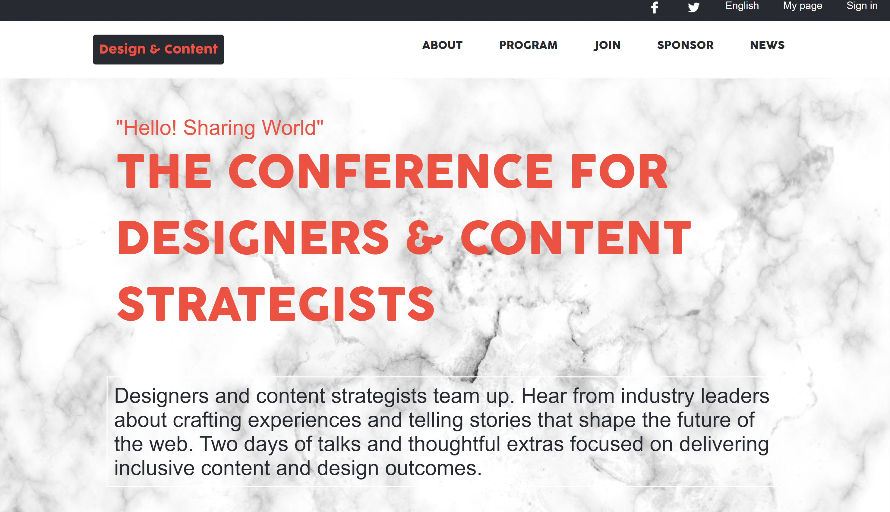
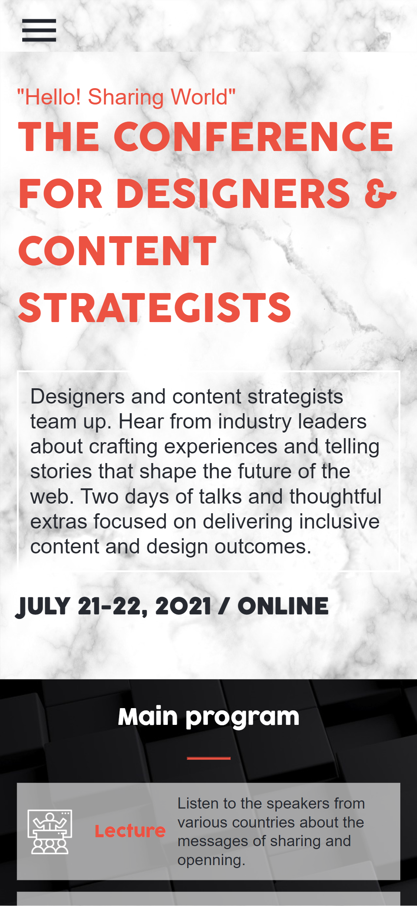

# Design & Content conference website

> Conference website built for Capstone project.

Conference website built with html, css and js.

## Built With

- HTMl5
- CSS3
- Vanilla JavaScript

## Live Demo

[Live Demo link ](youmari.github.io/capstone-project1/)

## Getting Started

To get a local copy up and running follow these simple example steps.

### Setup

- Clone the project to your local computer by copy the ssh or https link

### Install
- You don't need to install anything after clonning  the project open index.html with the browser to see the website

### Deployment

- The website is deployed using GitHub pages,

## Authors

👤 **Youmari**

- GitHub: [@youmari](https://github.com/youmari)
- Twitter: [@yf_omari](https://twitter.com/yf_omari)
- LinkedIn: [LinkedIn](https://www.linkedin.com/in/yassine-omari-945114190/)

## 🤝 Contributing

Contributions, issues, and feature requests are welcome!

Feel free to check the [issues page](../../issues/).

## Show your support

Give a ⭐️ if you like this project!

## Acknowledgments

- Thanks to Cindy Shin The Designer of the website (https://www.behance.net/adagio07)

## 📝 License

This project is [MIT](./MIT.md) licensed.
